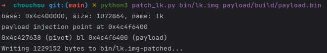

# ChouChou
Payload for bootloader (lk) modification for Moto G13/G23 phones (penangf)

[More info](https://penangf.fuckyoumoto.xyz/docs/modding/custom-bootloader)



## Features
- Removes orange state 
- Spoofes verified state to green (Required to bypass SafetyNet / Play Integrity)
- Blocks ```fastboot flash preloader```
- Blocks ```fastboot flashing lock``` 
- Adds ```fastboot oem help``` 
- Adds ```fastboot oem hexdump```

## Build
### Arch Linux
1. Install dependencies
    ```shell
    sudo pacman -S arm-none-eabi-newlib arm-none-eabi-gcc
    ```
2. Run build
    ```shell
   cd payload; make; cd ..
    ```

## Using
```shell
python3 patch_lk.py <YOUR LK> <PAYLOAD>
```
### Example:
```shell
python3 patch_lk.py bin/lk.img payload/build/payload.bin
```